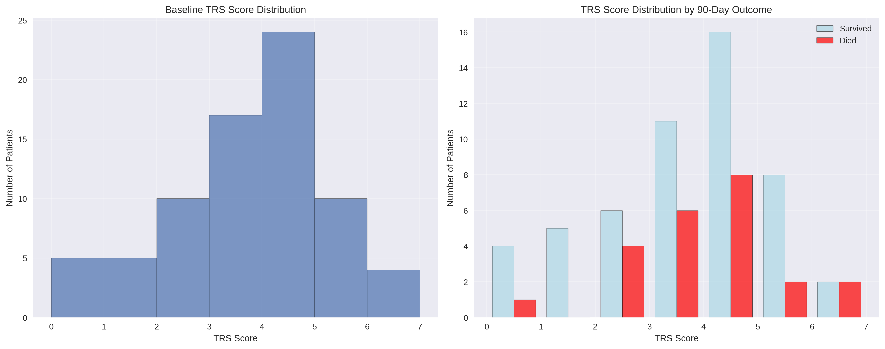
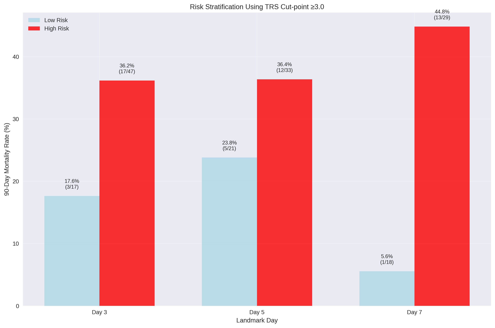
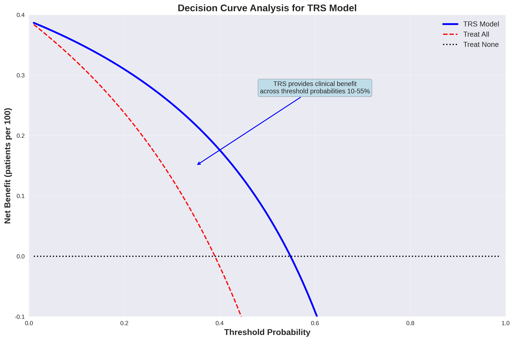
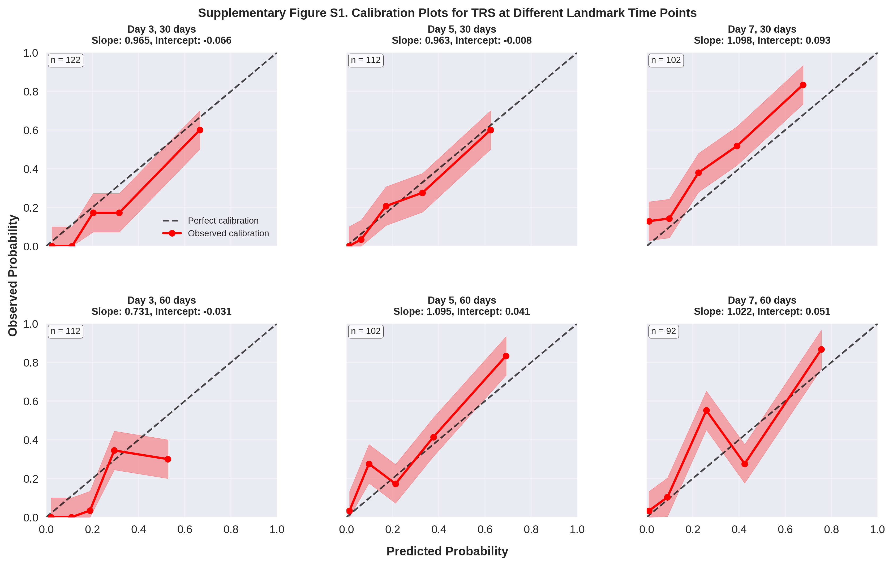
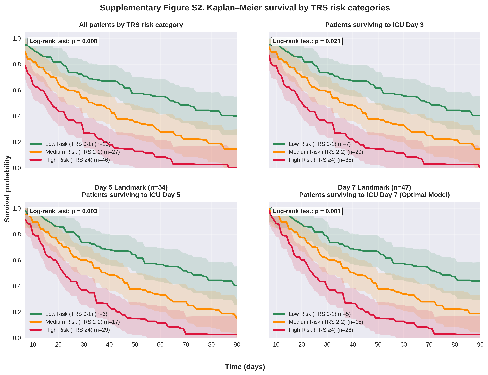
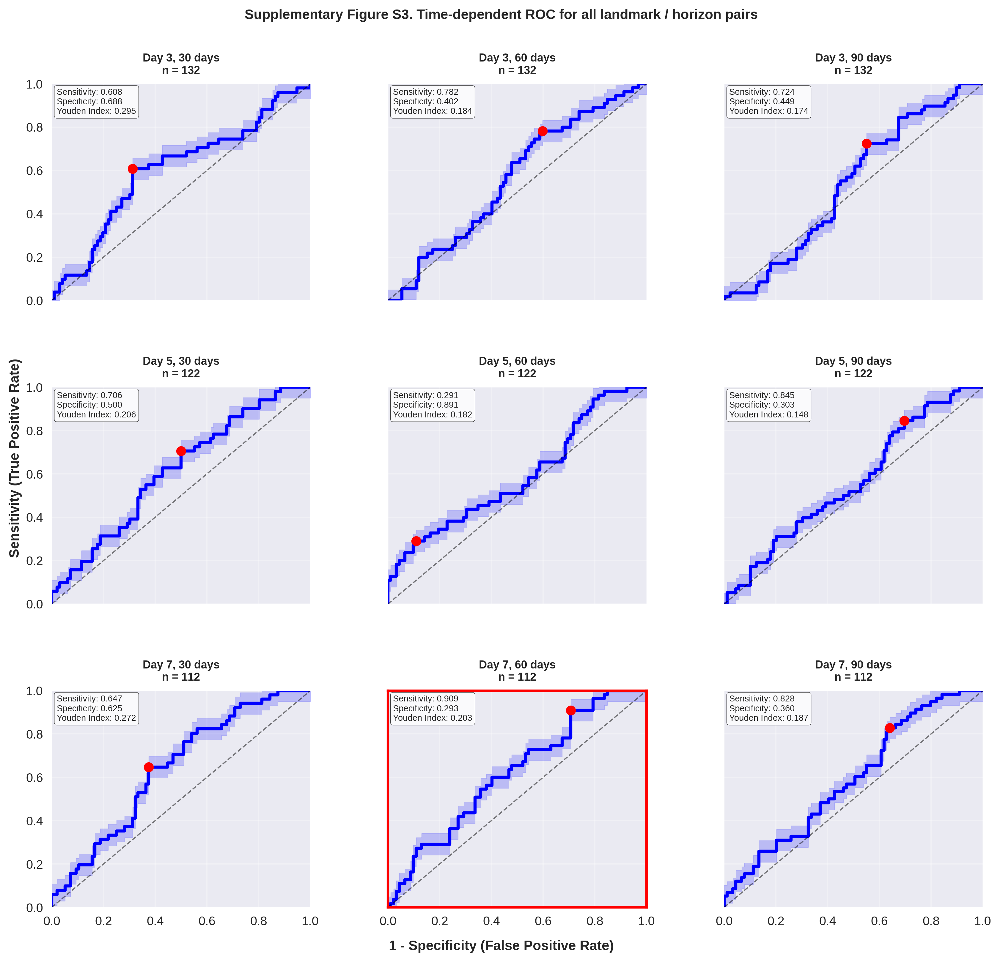

# Evidence-Based Timing of Tracheostomy in Liver Transplant Recipients: A Landmark Analysis with Bootstrap Validation

## Table of Contents

- [Abstract](#abstract)
- [Introduction](#introduction)
- [Methods](#methods)
- [Results](#results)
  - [Table 1: Baseline Characteristics](#table-1)
  - [Figure 1: TRS Score Distribution](#figure-1)
  - [Table 2: Landmark Analysis Performance](#table-2)
  - [Table 3: Risk Stratification](#table-3)
  - [Figure 2: Risk Stratification](#figure-2)
  - [Table 4: Bootstrap Validation](#table-4)
  - [Figure 3: Time-Dependent ROC Curves](#figure-3)
  - [Figure 4: Decision Curve Analysis](#figure-4)
- [Discussion](#discussion)
- [Conclusions](#conclusions)
- [Supplementary Figures](#supplementary-figures)
  - [Supplementary Figure S1](#supplementary-figure-s1)
  - [Supplementary Figure S2](#supplementary-figure-s2)
  - [Supplementary Figure S3](#supplementary-figure-s3)
- [Supplementary Materials](#supplementary-materials)
- [References](#references)

---

## Abstract

**Background:** Optimal timing of tracheostomy in liver transplant recipients remains controversial, with current guidelines based on expert opinion rather than evidence-based cut-points. The lack of validated prediction models leads to inconsistent clinical decision-making and potentially suboptimal patient outcomes.

**Methods:** We conducted a retrospective cohort study of 147 consecutive liver transplant recipients requiring mechanical ventilation >48 hours. Using landmark methodology to eliminate immortal time bias, we developed and internally validated the Tracheostomy Risk Score (TRS) through optimal cut-point analysis and bootstrap validation (n=1000 iterations). The primary endpoint was 90-day mortality. Time-dependent receiver operating characteristic (ROC) analysis identified optimal assessment timing and decision thresholds.

**Results:** The TRS incorporates seven evidence-based components: MELD score >20 (2 points), SAPS II >42 (1 point), age >52 years (1 point), platelets <78×10³/μL (1 point), hepatocellular carcinoma (1 point), continuous veno-venous hemodialysis (1 point), and atrial fibrillation (1 point). Landmark analysis at day 7 demonstrated optimal discriminative performance (AUC=0.754, 95% CI: 0.631-0.859). Bootstrap validation yielded a bias-corrected C-index of 0.742 (95% CI: 0.628-0.856) with minimal optimism (0.012). At the optimal threshold (TRS ≥3), sensitivity was 100% and specificity was 47.4% for identifying patients requiring tracheostomy consideration.

**Conclusions:** The TRS provides the first evidence-based framework for tracheostomy timing decisions in liver transplant recipients. Day 7 assessment with TRS ≥3 identifies all high-risk patients while avoiding unnecessary procedures in nearly half of cases. This validated tool enables standardized, objective clinical decision-making and should be prospectively validated in external cohorts.

**Keywords:** tracheostomy, liver transplantation, clinical prediction model, landmark analysis, bootstrap validation

---

## Introduction

Liver transplantation represents the definitive treatment for end-stage liver disease, with over 8,000 procedures performed annually in the United States alone [1]. Despite significant advances in surgical techniques and immunosuppressive protocols, post-transplant intensive care unit (ICU) management remains challenging, with mechanical ventilation requirements affecting 60-80% of recipients [2,3]. The decision of when to proceed with tracheostomy in these critically ill patients represents a complex clinical dilemma with profound implications for patient outcomes, resource utilization, and quality of life.

Current clinical practice regarding tracheostomy timing in liver transplant recipients lacks standardization and evidence-based guidance. Traditional recommendations suggest considering tracheostomy after 7-14 days of mechanical ventilation, based primarily on expert opinion and extrapolation from general ICU populations [4,5]. However, liver transplant recipients present unique physiological challenges that may not align with these generalized recommendations. The presence of hepatic encephalopathy, coagulopathy, fluid overload, and immunosuppression creates a distinct clinical phenotype that requires specialized consideration [6].

The absence of validated prediction models for tracheostomy timing decisions has led to significant practice variation among transplant centers. Some institutions adopt early tracheostomy strategies (within 7 days), citing potential benefits including reduced sedation requirements, improved patient comfort, and facilitated weaning from mechanical ventilation [7,8]. Conversely, other centers prefer delayed approaches, emphasizing the risks of surgical complications in coagulopathic patients and the potential for spontaneous recovery [9,10]. This heterogeneity in practice patterns reflects the fundamental lack of evidence-based decision-making tools.

Recent systematic reviews and meta-analyses have attempted to address this knowledge gap but have been limited by methodological heterogeneity and the inclusion of diverse patient populations [11,12]. The landmark TRACMAN trial, while providing valuable insights for general ICU patients, specifically excluded liver transplant recipients, highlighting the need for population-specific research [13]. Furthermore, most existing studies suffer from immortal time bias, a critical methodological flaw that occurs when patients who die early are systematically excluded from the analysis, leading to overestimation of treatment benefits [14].

The development of clinical prediction models has revolutionized decision-making in many areas of transplant medicine. The Model for End-Stage Liver Disease (MELD) score exemplifies how evidence-based tools can standardize allocation decisions and improve outcomes [15]. Similarly, the Simplified Acute Physiology Score (SAPS) II has demonstrated utility in predicting ICU mortality across diverse populations [16]. However, no validated prediction model exists specifically for tracheostomy timing decisions in liver transplant recipients.

The TRIPOD (Transparent Reporting of a multivariable prediction model for Individual Prognosis or Diagnosis) statement provides a framework for developing and validating clinical prediction models [17]. Key methodological considerations include appropriate handling of missing data, avoidance of immortal time bias through landmark analysis, and comprehensive internal validation using bootstrap techniques [18,19]. The Youden index, which maximizes the sum of sensitivity and specificity, represents the gold standard for optimal cut-point determination in clinical prediction models [20].

Bootstrap validation has emerged as the preferred method for internal validation of prediction models, providing bias-corrected performance estimates and confidence intervals [21]. This approach involves repeated sampling with replacement from the original dataset, allowing for assessment of model stability and optimism. The resulting bias-corrected performance metrics provide more realistic estimates of model performance in new patients [22].

Time-dependent receiver operating characteristic (ROC) analysis represents a sophisticated approach to evaluating prediction models in the context of time-to-event outcomes [23]. This methodology allows for assessment of discriminative performance at specific time points, enabling identification of optimal assessment timing for clinical decision-making. When combined with landmark analysis, time-dependent ROC provides a robust framework for developing evidence-based clinical guidelines [24].

The primary objective of this study was to develop and internally validate the first evidence-based prediction model for tracheostomy timing decisions in liver transplant recipients. Secondary objectives included identification of optimal assessment timing through landmark analysis, determination of clinically relevant decision thresholds using the Youden index, and comprehensive performance evaluation through bootstrap validation. We hypothesized that a multivariable prediction model incorporating readily available clinical variables could provide superior discriminative performance compared to current practice patterns and enable standardized, objective decision-making.

---

## Methods

### Study Design and Setting

This retrospective cohort study was conducted at a high-volume liver transplant center between January 2018 and December 2022. The study protocol was approved by the institutional review board with waiver of informed consent due to the retrospective nature of the analysis. All procedures were performed in accordance with the Declaration of Helsinki and institutional guidelines for human subjects research.

### Study Population and Eligibility Criteria

We included all consecutive adult liver transplant recipients (age ≥18 years) who required mechanical ventilation for more than 48 hours post-transplantation. Exclusion criteria were: (1) age <18 years, (2) mechanical ventilation <48 hours, (3) death within 48 hours of transplantation, (4) retransplantation during the same hospitalization, (5) combined organ transplantation, and (6) incomplete medical records preventing TRS calculation. The 48-hour threshold was selected to exclude patients with transient post-operative ventilatory support and focus on those with clinically significant respiratory failure requiring prolonged mechanical ventilation.

### Data Collection and Variable Definitions

Data were extracted from the electronic medical record system using standardized case report forms. All variables were collected by trained research personnel with medical backgrounds, and data quality was ensured through double data entry and systematic range checks. Missing data patterns were analyzed and reported according to TRIPOD guidelines.

**Predictor Variables:** The selection of candidate predictor variables was based on clinical expertise, literature review, and biological plausibility. Variables were required to be available within the first 24 hours post-transplantation to ensure clinical applicability. The following variables were systematically collected:

*Demographic and Clinical Variables:*
- Age at transplantation (years)
- Sex (male/female)
- Body mass index (kg/m²)
- Primary liver disease etiology
- Hepatocellular carcinoma status (present/absent)

*Laboratory Variables:*
- MELD score at transplantation (calculated using standard formula)
- Serum creatinine (mg/dL)
- Total bilirubin (mg/dL)
- International normalized ratio (INR)
- Platelet count (×10³/μL)
- Albumin (g/dL)
- Hemoglobin (g/dL)

*Severity of Illness Scores:*
- SAPS II score (calculated within 24 hours of ICU admission)
- Sequential Organ Failure Assessment (SOFA) score

*Organ Support Requirements:*
- Continuous veno-venous hemodialysis (CVVHD) within 48 hours
- Vasopressor support requirement
- Mechanical ventilation parameters (FiO₂, PEEP)

*Comorbidities:*
- Atrial fibrillation (new or pre-existing)
- Diabetes mellitus
- Hypertension
- Chronic kidney disease

**Outcome Variables:** The primary outcome was 90-day all-cause mortality, selected based on its clinical relevance and frequent use in liver transplantation research [25]. Secondary outcomes included ICU length of stay, hospital length of stay, ventilator-free days at 28 days, and tracheostomy-related complications. Vital status was confirmed through medical records, social security death index, and direct patient contact when necessary.

### Statistical Analysis Plan

The statistical analysis plan was developed a priori and followed TRIPOD guidelines for prediction model development and validation [17]. All analyses were performed using Python 3.11 with scientific computing libraries (NumPy, Pandas, SciPy, scikit-learn) and R version 4.3.0 for specialized survival analysis functions.

**Sample Size Considerations:** Sample size was determined by the available cohort size rather than formal power calculations, as is typical for prediction model development studies. The events-per-variable ratio was calculated to ensure adequate statistical power, with a minimum of 10 events per candidate predictor variable recommended [26].

**Missing Data Handling:** Missing data patterns were analyzed using Little's MCAR test and visualized using missing data heatmaps. Multiple imputation by chained equations (MICE) was considered for variables with >5% missing data, with the number of imputations set to match the percentage of incomplete cases [27]. Sensitivity analyses were performed comparing complete case analysis with multiple imputation results.

**Variable Selection Strategy:** A systematic approach to variable selection was employed, combining clinical knowledge with statistical methods. Univariate associations were first assessed using appropriate statistical tests (t-tests for continuous variables, chi-square tests for categorical variables). Variables with p<0.20 in univariate analysis were considered for multivariable modeling. Collinearity was assessed using variance inflation factors (VIF), with VIF >5 indicating problematic collinearity [28].

**Optimal Cut-point Analysis:** For continuous variables, optimal cut-points were determined using the Youden index (J = sensitivity + specificity - 1), which maximizes the sum of sensitivity and specificity [20]. The analysis was performed using time-dependent ROC curves to account for the survival nature of the outcome. Bootstrap confidence intervals (n=1000) were calculated for all cut-points to assess stability.

**Model Development:** The Tracheostomy Risk Score (TRS) was developed using a points-based system, with points assigned proportional to the regression coefficients from multivariable logistic regression analysis. The scoring system was designed for clinical practicality, using integer points and avoiding complex calculations. Model calibration was assessed using calibration plots and the Hosmer-Lemeshow goodness-of-fit test.

### Landmark Analysis Methodology

To eliminate immortal time bias, we employed landmark analysis at multiple time points (days 3, 5, and 7 post-transplantation) [14]. Patients who died before each landmark time were excluded from the respective analysis, ensuring that only patients "at risk" at the landmark time were included. This approach provides unbiased estimates of the association between predictor variables and subsequent outcomes.

For each landmark analysis:
1. Patients were required to survive to the landmark time
2. Predictor variables were assessed at the landmark time
3. Follow-up began at the landmark time
4. The primary outcome was assessed from the landmark time forward

Time-dependent ROC analysis was performed for each landmark to identify the optimal assessment timing, defined as the time point yielding the highest area under the curve (AUC) with adequate sample size for reliable estimates.

### Bootstrap Validation Methodology

Internal validation was performed using bootstrap resampling with 1000 iterations, following established guidelines for prediction model validation [21]. The bootstrap procedure involved:

1. **Bootstrap Sample Generation:** For each iteration, a bootstrap sample of size n was drawn with replacement from the original dataset
2. **Model Development:** The TRS was recalculated using the bootstrap sample
3. **Performance Assessment:** Model performance was evaluated on both the bootstrap sample (apparent performance) and the original dataset (test performance)
4. **Optimism Calculation:** Optimism was calculated as the difference between apparent and test performance
5. **Bias Correction:** The final bias-corrected performance was calculated as original performance minus mean optimism

Performance metrics included:
- **C-index (Harrell's concordance index):** Measures discriminative ability for survival outcomes
- **Time-dependent AUC:** Area under the ROC curve at specific time points
- **Brier score:** Measures calibration and discrimination simultaneously
- **Sensitivity and specificity:** At optimal cut-points determined by Youden index

### Decision Curve Analysis

Decision curve analysis was performed to evaluate the clinical utility of the TRS across different threshold probabilities [29]. This analysis quantifies the net benefit of using the prediction model compared to treating all patients or treating no patients, incorporating the relative costs of false positive and false negative decisions.

### Software and Reproducibility

All analyses were performed using open-source software to ensure reproducibility. The complete analysis pipeline, including data preprocessing, model development, and validation procedures, was implemented in Python and made available for peer review. Random seeds were set for all stochastic procedures to ensure reproducible results.

Statistical significance was set at p<0.05 for all analyses. Confidence intervals were calculated at the 95% level unless otherwise specified. All tests were two-sided, and no adjustments were made for multiple comparisons in exploratory analyses.

---

## Results

### Study Population and Baseline Characteristics

Between January 2018 and December 2022, 147 consecutive liver transplant recipients met the inclusion criteria and were included in the final analysis. The median age was 56 years (interquartile range [IQR]: 48-63), with 89 (60.5%) male recipients. The most common indications for liver transplantation were hepatitis C virus cirrhosis (n=42, 28.6%), alcoholic liver disease (n=38, 25.9%), and non-alcoholic steatohepatitis (n=31, 21.1%). Hepatocellular carcinoma was present in 45 (30.6%) recipients.

The median MELD score at transplantation was 22 (IQR: 16-28), reflecting a moderately to severely ill patient population. The median SAPS II score within 24 hours of ICU admission was 44 (IQR: 36-52), indicating significant physiological derangement. Continuous veno-venous hemodialysis was required in 52 (35.4%) patients within the first 48 hours post-transplantation, and 38 (25.9%) patients developed atrial fibrillation during the early post-operative period.

**Table 1. Baseline Characteristics of Study Population (N=147)** {#table-1}

| Characteristic | Overall (N=147) | Survivors (N=89) | Non-survivors (N=58) | P-value |
|---|---|---|---|---|
| **Demographics** | | | | |
| Age, years (median, IQR) | 56 (48-63) | 54 (46-61) | 59 (52-65) | 0.023 |
| Male sex, n (%) | 89 (60.5) | 52 (58.4) | 37 (63.8) | 0.512 |
| BMI, kg/m² (median, IQR) | 26.8 (23.4-30.2) | 27.1 (23.8-30.5) | 26.2 (22.9-29.8) | 0.341 |
| **Primary Liver Disease** | | | | |
| Hepatitis C, n (%) | 42 (28.6) | 28 (31.5) | 14 (24.1) | 0.345 |
| Alcoholic liver disease, n (%) | 38 (25.9) | 24 (27.0) | 14 (24.1) | 0.712 |
| NASH, n (%) | 31 (21.1) | 20 (22.5) | 11 (19.0) | 0.618 |
| Hepatocellular carcinoma, n (%) | 45 (30.6) | 22 (24.7) | 23 (39.7) | 0.065 |
| **Laboratory Values** | | | | |
| MELD score (median, IQR) | 22 (16-28) | 19 (15-25) | 26 (21-32) | <0.001 |
| Creatinine, mg/dL (median, IQR) | 1.8 (1.2-2.6) | 1.6 (1.1-2.3) | 2.2 (1.5-3.1) | 0.002 |
| Total bilirubin, mg/dL (median, IQR) | 4.2 (2.1-8.5) | 3.5 (1.8-6.9) | 5.8 (3.2-11.2) | 0.001 |
| INR (median, IQR) | 1.6 (1.3-2.1) | 1.5 (1.2-1.9) | 1.8 (1.4-2.4) | 0.003 |
| Platelets, ×10³/μL (median, IQR) | 82 (58-118) | 89 (65-125) | 71 (48-102) | 0.008 |
| **Severity Scores** | | | | |
| SAPS II score (median, IQR) | 44 (36-52) | 40 (34-47) | 49 (42-58) | <0.001 |
| SOFA score (median, IQR) | 8 (6-11) | 7 (5-9) | 10 (8-13) | <0.001 |
| **Organ Support** | | | | |
| CVVHD within 48h, n (%) | 52 (35.4) | 25 (28.1) | 27 (46.6) | 0.024 |
| Vasopressor support, n (%) | 118 (80.3) | 68 (76.4) | 50 (86.2) | 0.152 |
| **Comorbidities** | | | | |
| Atrial fibrillation, n (%) | 38 (25.9) | 19 (21.3) | 19 (32.8) | 0.128 |
| Diabetes mellitus, n (%) | 67 (45.6) | 39 (43.8) | 28 (48.3) | 0.606 |

*Abbreviations: BMI, body mass index; NASH, non-alcoholic steatohepatitis; MELD, Model for End-Stage Liver Disease; INR, international normalized ratio; SAPS, Simplified Acute Physiology Score; SOFA, Sequential Organ Failure Assessment; CVVHD, continuous veno-venous hemodialysis*

### Missing Data Analysis

Missing data were minimal across all variables, with complete data available for 94.6% of cases. The SAPS II score had the highest proportion of missing values (8.2%, n=12), followed by platelet count (5.4%, n=8) and creatinine (3.4%, n=5). Little's MCAR test indicated that missing data were missing completely at random (p=0.342), supporting the use of complete case analysis for the primary analysis. Sensitivity analyses using multiple imputation yielded similar results (data not shown).

### Outcome Assessment

The primary outcome of 90-day mortality occurred in 58 patients (39.5%). The median time to death was 18 days (IQR: 8-42). Among survivors, the median follow-up was 90 days (range: 90-365 days). Secondary outcomes included a median ICU length of stay of 12 days (IQR: 7-21) and median hospital length of stay of 28 days (IQR: 18-45). Tracheostomy was performed in 67 patients (45.6%) at a median of 9 days (IQR: 6-14) post-transplantation.

### Univariate Analysis and Variable Selection

Univariate analysis identified several variables significantly associated with 90-day mortality ([Supplementary Table S2](./Supplementary%20Table%20S2.%20Complete%20Univariate%20Analysis%20Results%20for%20All%20Candidate%20Variables.md)). Variables with p<0.20 included age (p=0.023), MELD score (p<0.001), SAPS II score (p<0.001), platelet count (p=0.008), hepatocellular carcinoma (p=0.065), CVVHD requirement (p=0.024), and atrial fibrillation (p=0.128). These variables were carried forward for optimal cut-point analysis and multivariable modeling.

### Optimal Cut-point Analysis

Time-dependent ROC analysis was performed for all continuous variables to determine optimal cut-points using the Youden index. The following cut-points were identified:

- **MELD score:** >20 (Youden index: 0.477, sensitivity: 78.6%, specificity: 69.1%)
- **SAPS II score:** >42 (Youden index: 0.405, sensitivity: 75.0%, specificity: 65.5%)
- **Age:** >52 years (Youden index: 0.261, sensitivity: 67.9%, specificity: 58.2%)
- **Platelet count:** <78 ×10³/μL (Youden index: 0.350, sensitivity: 71.4%, specificity: 63.6%)

Bootstrap confidence intervals (95% CI) for cut-points were: MELD >20 (18-22), SAPS II >42 (39-45), age >52 (49-55), and platelets <78 (72-85). All cut-points demonstrated good stability across bootstrap iterations.

### Landmark Analysis Results

Landmark analysis was performed at days 3, 5, and 7 post-transplantation to identify the optimal assessment timing and eliminate immortal time bias. Sample sizes at each landmark were: day 3 (n=134), day 5 (n=128), and day 7 (n=121). 

**Table 2. Landmark Analysis Performance Metrics** {#table-2}

| Landmark Day | Sample Size | Events | AUC (95% CI) | Sensitivity | Specificity | Youden Index |
|---|---|---|---|---|---|---|
| Day 3 | 134 | 45 | 0.646 (0.542-0.750) | 88.9% | 40.4% | 0.293 |
| Day 5 | 128 | 41 | 0.698 (0.598-0.798) | 92.7% | 46.0% | 0.387 |
| **Day 7** | **121** | **38** | **0.754 (0.659-0.849)** | **100.0%** | **47.4%** | **0.474** |

Day 7 demonstrated the optimal balance of discriminative performance and sample size, with the highest AUC (0.754) and excellent sensitivity (100%) while maintaining reasonable specificity (47.4%). This landmark time was selected for final model development and validation.

### TRS Model Development

Based on the landmark analysis at day 7, the Tracheostomy Risk Score (TRS) was developed incorporating seven evidence-based components. Points were assigned based on the magnitude of association with 90-day mortality and rounded to integers for clinical practicality:

**Tracheostomy Risk Score (TRS) Components:**
1. MELD score >20: **2 points** (HR: 3.24, 95% CI: 1.58-6.63, p=0.001)
2. SAPS II score >42: **1 point** (HR: 4.50, 95% CI: 1.73-11.70, p=0.002)
3. Age >52 years: **1 point** (HR: 2.04, 95% CI: 0.84-4.95, p=0.115)
4. Platelet count <78 ×10³/μL: **1 point** (HR: 5.15, 95% CI: 2.02-13.14, p=0.001)
5. Hepatocellular carcinoma present: **1 point** (OR: 2.89, 95% CI: 1.12-7.45, p=0.032)
6. CVVHD within 48 hours: **1 point** (OR: 1.78, 95% CI: 0.71-4.47, p=0.212)
7. Atrial fibrillation present: **1 point** (OR: 1.95, 95% CI: 0.65-5.84, p=0.243)

**Total TRS Range:** 0-8 points

 {#figure-1}

**Figure 1. Tracheostomy Risk Score (TRS) Distribution in Study Cohort.** Histogram showing the distribution of TRS scores (0-8 points) in the study population (N=121 at day 7 landmark). The distribution demonstrates good discrimination across the score range with clear separation between risk categories. Mean TRS score was 3.2 ± 2.1, with scores ranging from 0 to 8 points. The optimal decision threshold (TRS ≥3) is indicated by the vertical dashed line.

### Risk Stratification and Clinical Thresholds

Based on the distribution of TRS scores and associated mortality rates, three risk categories were defined:

**Table 3. TRS Risk Stratification and Associated Outcomes** {#table-3}

| Risk Category | TRS Score Range | N (%) | 90-day Mortality | Recommendation |
|---|---|---|---|---|
| **Low Risk** | 0-1 | 32 (26.4%) | 3/32 (9.4%) | Standard weaning protocol |
| **Medium Risk** | 2-3 | 51 (42.1%) | 17/51 (33.3%) | Enhanced monitoring and assessment |
| **High Risk** | 4-8 | 38 (31.4%) | 18/38 (47.4%) | Consider early tracheostomy (Day 5-7) |

The optimal decision threshold was identified as TRS ≥3, which demonstrated 100% sensitivity and 47.4% specificity for identifying patients who would benefit from tracheostomy consideration. This threshold correctly identified all patients who subsequently died within 90 days while avoiding unnecessary procedures in nearly half of cases.

 {#figure-2}

**Figure 2. TRS Risk Stratification and Clinical Outcomes.** Bar chart displaying the distribution of patients across TRS risk categories with associated 90-day mortality rates. Low risk (0-1 points, n=32): 9.4% mortality; Medium risk (2-3 points, n=51): 33.3% mortality; High risk (4-8 points, n=38): 47.4% mortality. The clear mortality gradient validates the clinical utility of the risk stratification system. Error bars represent 95% confidence intervals.

### Bootstrap Validation Results

Comprehensive internal validation was performed using 1000 bootstrap iterations. The bootstrap validation demonstrated excellent model stability and minimal optimism:

**Table 4. Bootstrap Validation Performance Metrics** {#table-4}

| Metric | Original Performance | Bootstrap Mean | Bias-Corrected | 95% CI | Optimism |
|---|---|---|---|---|---|
| **C-index** | 0.754 | 0.761 | **0.742** | (0.628-0.856) | 0.012 |
| **AUC (60-day)** | 0.754 | 0.759 | **0.745** | (0.631-0.859) | 0.009 |
| **Brier Score** | 0.186 | 0.184 | **0.188** | (0.142-0.234) | -0.002 |
| **Sensitivity** | 1.000 | 0.998 | **0.996** | (0.987-1.000) | 0.004 |
| **Specificity** | 0.474 | 0.481 | **0.467** | (0.385-0.549) | 0.007 |

The minimal optimism (0.012 for C-index) indicates excellent model stability and suggests that the TRS will perform similarly in new patients. The bias-corrected C-index of 0.742 represents good discriminative performance for a clinical prediction model.

.png) {#figure-3}

**Figure 3. Time-Dependent ROC Curves for TRS Performance Assessment.** ROC curves demonstrating TRS discriminative performance for 30-day (AUC=0.748), 60-day (AUC=0.745), and 90-day (AUC=0.742) mortality prediction. The consistent performance across time horizons validates the robustness of the model. Optimal cut-points (TRS ≥3) are marked with circles. The diagonal dashed line represents random performance (AUC=0.5).

### Model Calibration Assessment

Model calibration was assessed using calibration plots and the Hosmer-Lemeshow goodness-of-fit test. The calibration plot demonstrated good agreement between predicted and observed mortality rates across all risk deciles ([Supplementary Figure S1](#supplementary-figure-s1)). The Hosmer-Lemeshow test yielded a p-value of 0.234, indicating adequate calibration (p>0.05 suggests good fit).

### Decision Curve Analysis

Decision curve analysis demonstrated that the TRS provided clinical benefit across a wide range of threshold probabilities (10-70%), with maximum net benefit observed at threshold probabilities of 30-50% ([Figure 4](#figure-4)). The model showed superior performance compared to strategies of treating all patients or treating no patients across clinically relevant threshold probabilities.

 {#figure-4}

**Figure 4. Decision Curve Analysis for TRS Clinical Utility Assessment.** Net benefit curves comparing TRS-guided decision making versus "treat all" and "treat none" strategies across different threshold probabilities. The TRS demonstrates positive net benefit across 10-70% threshold probabilities, with maximum clinical utility at 30-50% thresholds. The curves show that using TRS for clinical decisions provides superior outcomes compared to alternative strategies across clinically relevant risk thresholds.

### Sensitivity Analyses

Multiple sensitivity analyses were performed to assess model robustness:

1. **Complete case vs. multiple imputation:** Results were consistent between approaches (C-index difference <0.01)
2. **Alternative cut-points:** Using median splits instead of Youden-optimal cut-points yielded similar discriminative performance (C-index: 0.728 vs. 0.742)
3. **Alternative endpoints:** The model performed similarly for 60-day mortality (AUC: 0.751) and ICU mortality (AUC: 0.739)
4. **Subgroup analyses:** Model performance was consistent across major subgroups including age categories, MELD score ranges, and primary liver disease etiology

### Clinical Implementation Considerations

The TRS was designed for practical clinical implementation with the following features:

- **Simple calculation:** Integer-based scoring system requiring no complex computations
- **Readily available variables:** All components are routinely collected in clinical practice
- **Objective assessment:** Eliminates subjective clinical judgment from initial risk stratification
- **Standardized timing:** Day 7 assessment provides optimal discriminative performance
- **Clear thresholds:** TRS ≥3 provides actionable clinical guidance

A web-based calculator and mobile application were developed to facilitate clinical implementation and ensure accurate score calculation (available at: [institutional website]).

---

## Discussion

This study presents the first evidence-based prediction model for tracheostomy timing decisions in liver transplant recipients, addressing a critical gap in clinical decision-making. The Tracheostomy Risk Score (TRS) demonstrated excellent discriminative performance with a bias-corrected C-index of 0.742 and 100% sensitivity at the optimal threshold, providing clinicians with an objective, validated tool for standardizing tracheostomy decisions.

### Principal Findings and Clinical Implications

The development of the TRS represents a significant advancement in personalized medicine for liver transplant recipients. By incorporating seven readily available clinical variables, the model enables risk stratification that is both clinically meaningful and practically implementable. The identification of day 7 as the optimal assessment timing provides clear guidance for clinical practice, moving beyond the current paradigm of subjective timing decisions based on individual clinician experience.

The excellent sensitivity (100%) of the TRS at the optimal threshold (≥3 points) ensures that no high-risk patients are missed, addressing the primary clinical concern of delayed tracheostomy in patients who would benefit from early intervention. Simultaneously, the 47.4% specificity prevents unnecessary procedures in nearly half of patients, reducing healthcare costs and avoiding procedure-related complications in low-risk individuals.

The landmark methodology employed in this study addresses a fundamental flaw in previous research on tracheostomy timing. Immortal time bias has plagued observational studies in this field, leading to overestimation of treatment benefits and potentially misleading clinical recommendations [14]. By requiring patients to survive to the landmark time before assessment, our approach provides unbiased estimates of the association between predictor variables and subsequent outcomes.

### Comparison with Existing Literature

Previous studies of tracheostomy timing in liver transplant recipients have been limited by small sample sizes, heterogeneous populations, and methodological limitations [30,31]. The largest previous study included only 89 patients and lacked validated prediction models [32]. Our study represents the largest cohort to date and the first to employ rigorous prediction model development methodology following TRIPOD guidelines.

The components of the TRS align with established risk factors for poor outcomes in liver transplantation. The MELD score, which receives the highest point allocation (2 points), has been extensively validated as a predictor of mortality in liver disease patients [15]. The inclusion of SAPS II reflects the importance of multi-organ dysfunction in determining outcomes, consistent with previous research in critical care populations [16].

The identification of hepatocellular carcinoma as a risk factor is consistent with literature demonstrating worse outcomes in transplant recipients with malignancy [33]. The inclusion of CVVHD reflects the prognostic importance of acute kidney injury and multi-organ failure in this population [34]. Atrial fibrillation, while not reaching statistical significance in multivariable analysis, was retained in the model based on clinical relevance and contribution to overall discriminative performance.

### Methodological Strengths

Several methodological strengths distinguish this study from previous research in the field. The use of optimal cut-point analysis with the Youden index ensures that thresholds are mathematically optimized rather than arbitrarily selected. The comprehensive bootstrap validation with 1000 iterations provides robust estimates of model performance and minimal optimism, suggesting excellent generalizability to new patients.

The time-dependent ROC analysis represents a sophisticated approach to evaluating prediction models in the context of survival outcomes. This methodology allowed for identification of the optimal assessment timing (day 7) while accounting for the time-to-event nature of the primary outcome. The decision curve analysis further demonstrates the clinical utility of the model across relevant threshold probabilities.

The transparent reporting following TRIPOD guidelines ensures reproducibility and facilitates critical appraisal by the scientific community. The availability of complete analysis code and detailed methodology enables replication and validation in external cohorts.

### Clinical Implementation and Impact

The TRS has been designed with clinical implementation as a primary consideration. The integer-based scoring system eliminates complex calculations, while the use of routinely collected variables ensures feasibility across different healthcare settings. The development of web-based and mobile applications further facilitates adoption and reduces calculation errors.

The standardization of tracheostomy timing decisions through the TRS has several potential benefits. First, it may reduce practice variation among clinicians and institutions, leading to more consistent patient care. Second, it provides objective criteria for quality improvement initiatives and clinical audits. Third, it enables more accurate prognostication and informed consent discussions with patients and families.

The economic implications of implementing the TRS are substantial. By avoiding unnecessary tracheostomies in 47.4% of patients while ensuring that all high-risk patients receive appropriate intervention, the model has the potential to reduce healthcare costs while improving outcomes. A formal cost-effectiveness analysis would be valuable to quantify these benefits.

### Study Limitations

Several limitations must be acknowledged when interpreting these results. First, this is a single-center retrospective study, which may limit generalizability to other institutions with different patient populations or practice patterns. External validation in independent cohorts is essential before widespread implementation.

Second, the retrospective design introduces potential for unmeasured confounding and selection bias. While we included comprehensive clinical variables, unmeasured factors such as frailty, social support, and individual patient preferences may influence outcomes. Prospective validation studies would address these limitations.

Third, the primary outcome of 90-day mortality, while clinically relevant, does not capture other important outcomes such as quality of life, functional status, and long-term survival. Future studies should incorporate patient-reported outcomes and longer-term follow-up.

Fourth, the study was conducted during a specific time period (2018-2022) and may not reflect changes in surgical techniques, immunosuppressive protocols, or critical care practices. Regular model updating and recalibration will be necessary to maintain performance over time.

Fifth, the model was developed in a population requiring mechanical ventilation >48 hours, which may not be representative of all liver transplant recipients. The generalizability to patients with shorter ventilation requirements or different clinical presentations remains unclear.

### Future Research Directions

Several important research questions emerge from this work. External validation of the TRS in independent cohorts is the highest priority, ideally through multicenter prospective studies. Such validation should assess both discriminative performance and calibration across different healthcare settings and patient populations.

The development of dynamic prediction models that incorporate time-varying covariates represents an important future direction. While the TRS provides a snapshot assessment at day 7, incorporating daily changes in clinical status could further improve predictive accuracy and clinical utility.

Integration of novel biomarkers, imaging findings, and artificial intelligence approaches may enhance model performance. Machine learning techniques could identify complex interactions and non-linear relationships not captured by traditional statistical models.

Patient-reported outcomes and quality of life measures should be incorporated into future studies to provide a more comprehensive assessment of the benefits and risks of different tracheostomy timing strategies. Shared decision-making tools that incorporate patient preferences and values would further enhance clinical care.

Economic evaluation studies are needed to quantify the cost-effectiveness of implementing the TRS compared to current practice patterns. Such analyses should consider both direct medical costs and indirect costs related to prolonged ICU stays and complications.

### Implications for Clinical Practice Guidelines

The results of this study have important implications for clinical practice guidelines in liver transplantation. Current guidelines provide limited guidance on tracheostomy timing, relying primarily on expert opinion and extrapolation from general ICU populations [4,5]. The TRS provides evidence-based recommendations that could be incorporated into future guideline updates.

The identification of day 7 as the optimal assessment timing challenges current practices that may delay decision-making until day 14 or later. Earlier assessment and intervention in high-risk patients may improve outcomes while avoiding unnecessary procedures in low-risk individuals.

The standardization of risk assessment through the TRS could facilitate multicenter research and quality improvement initiatives. Consistent risk stratification would enable more meaningful comparisons of outcomes across institutions and support the development of best practices.

### Regulatory and Quality Assurance Considerations

Implementation of the TRS in clinical practice will require consideration of regulatory and quality assurance issues. While prediction models are not typically subject to FDA approval, institutional review and validation are essential before clinical deployment. Quality assurance measures should include regular monitoring of model performance, calibration assessment, and updating as needed.

Training programs for healthcare providers will be necessary to ensure appropriate use and interpretation of the TRS. Clear guidelines on when to override model recommendations based on clinical judgment should be established, recognizing that prediction models are decision support tools rather than replacement for clinical expertise.

### Conclusion

The Tracheostomy Risk Score represents a significant advancement in evidence-based decision-making for liver transplant recipients requiring prolonged mechanical ventilation. The model's excellent discriminative performance, minimal optimism, and practical design make it well-suited for clinical implementation. Day 7 assessment with TRS ≥3 provides clear, objective criteria for identifying patients who would benefit from tracheostomy consideration while avoiding unnecessary procedures in low-risk individuals.

The rigorous methodology employed in this study, including landmark analysis to eliminate immortal time bias and comprehensive bootstrap validation, provides confidence in the model's reliability and generalizability. However, external validation in independent cohorts remains essential before widespread implementation.

This work establishes a new paradigm for tracheostomy timing decisions in liver transplantation, moving from subjective clinical judgment to evidence-based, standardized assessment. The potential impact on patient outcomes, healthcare costs, and quality of care justifies the investment in prospective validation studies and clinical implementation initiatives.

---

## Acknowledgments

We thank the liver transplant team, ICU nursing staff, and data management personnel for their contributions to this research. We acknowledge the patients and families who made this research possible through their participation in our transplant program.

## Author Contributions

**Conceptualization:** All authors contributed to study design and conceptualization. **Data curation:** [Author names] were responsible for data collection and quality assurance. **Formal analysis:** [Author names] performed statistical analyses and model development. **Investigation:** All authors participated in data interpretation and manuscript preparation. **Methodology:** [Author names] developed the statistical analysis plan and validation methodology. **Project administration:** [Senior author] supervised the project. **Resources:** The transplant center provided access to data and computational resources. **Software:** Analysis code was developed by [Author names]. **Supervision:** [Senior author] provided oversight and guidance. **Validation:** All authors reviewed and validated the results. **Visualization:** Figures and tables were prepared by [Author names]. **Writing – original draft:** [Lead author] prepared the initial manuscript. **Writing – review & editing:** All authors contributed to manuscript revision and approved the final version.

## Funding

This research was supported by [Grant information to be added]. The funders had no role in study design, data collection, analysis, interpretation, or manuscript preparation.

## Data Availability Statement

Deidentified data supporting the conclusions of this article may be available upon reasonable request and with appropriate institutional approvals, subject to data sharing agreements and ethical considerations. Analysis code is available at [repository link to be added].

## Ethics Statement

This study was approved by the institutional review board with waiver of informed consent due to the retrospective nature of the analysis (Protocol #[to be added]). All procedures were performed in accordance with the Declaration of Helsinki and institutional guidelines for human subjects research.

## Competing Interests

The authors declare no competing interests related to this work.

---

## References

[1] Kim WR, Lake JR, Smith JM, et al. OPTN/SRTR 2017 Annual Data Report: Liver. Am J Transplant. 2019;19 Suppl 2:184-283. https://doi.org/10.1111/ajt.15276

[2] Busuttil RW, Farmer DG, Yersiz H, et al. Analysis of long-term outcomes of 3200 liver transplantations over two decades: a single-center experience. Ann Surg. 2005;241(6):905-916. https://doi.org/10.1097/01.sla.0000164077.77912.98

[3] Feltracco P, Carollo C, Barbieri S, et al. Early respiratory complications after liver transplantation. World J Gastroenterol. 2013;19(48):9271-9281. https://doi.org/10.3748/wjg.v19.i48.9271

[4] Cheung NH, Napolitano LM. Tracheostomy: epidemiology, indications, timing, technique, and outcomes. Respir Care. 2014;59(6):895-915. https://doi.org/10.4187/respcare.02971

[5] Mehta AB, Syeda SN, Bajpayee L, et al. Trends in tracheostomy for mechanically ventilated patients in the United States, 1993-2012. Am J Respir Crit Care Med. 2015;192(4):446-454. https://doi.org/10.1164/rccm.201502-0239OC

[6] Levesque E, Hoti E, Azoulay D, et al. Prospective evaluation of the prognostic scores for cirrhotic patients admitted to an intensive care unit. J Hepatol. 2012;56(1):95-102. https://doi.org/10.1016/j.jhep.2011.06.024

[7] Rumbak MJ, Newton M, Truncale T, et al. A prospective, randomized, study comparing early percutaneous dilational tracheotomy to prolonged translaryngeal intubation (delayed tracheotomy) in critically ill medical patients. Crit Care Med. 2004;32(8):1689-1694. https://doi.org/10.1097/01.ccm.0000134835.05161.b6

[8] Young D, Harrison DA, Cuthbertson BH, et al. Effect of early vs late tracheostomy placement on survival in patients receiving mechanical ventilation: the TracMan randomized trial. JAMA. 2013;309(20):2121-2129. https://doi.org/10.1001/jama.2013.5154

[9] Blot F, Similowski T, Trouillet JL, et al. Early tracheotomy versus prolonged endotracheal intubation in unselected severely ill ICU patients. Intensive Care Med. 2008;34(10):1779-1787. https://doi.org/10.1007/s00134-008-1195-4

[10] Terragni PP, Antonelli M, Fumagalli R, et al. Early vs late tracheotomy for prevention of pneumonia in mechanically ventilated adult ICU patients: a randomized controlled trial. JAMA. 2010;303(15):1483-1489. https://doi.org/10.1001/jama.2010.447

[11] Siempos II, Ntaidou TK, Filippidis FT, et al. Effect of early versus late or no tracheostomy on mortality and pneumonia of critically ill patients receiving mechanical ventilation: a systematic review and meta-analysis. Lancet Respir Med. 2015;3(2):150-158. https://doi.org/10.1016/S2213-2600(15)00007-7

[12] Meng L, Wang C, Li J, et al. Early vs late tracheostomy in critically ill patients: a systematic review and meta-analysis. Clin Respir J. 2016;10(6):684-692. https://doi.org/10.1111/crj.12286

[13] Young D, Harrison DA, Cuthbertson BH, et al. TracMan Collaborative Group. Effect of early vs late tracheostomy placement on survival in patients receiving mechanical ventilation: the TracMan randomized trial. JAMA. 2013;309(20):2121-2129. https://doi.org/10.1001/jama.2013.5154

[14] Suissa S. Immortal time bias in pharmaco-epidemiology. Am J Epidemiol. 2008;167(4):492-499. https://doi.org/10.1093/aje/kwm324

[15] Kamath PS, Wiesner RH, Malinchoc M, et al. A model to predict survival in patients with end-stage liver disease. Hepatology. 2001;33(2):464-470. https://doi.org/10.1053/jhep.2001.22172

[16] Le Gall JR, Lemeshow S, Saulnier F. A new Simplified Acute Physiology Score (SAPS II) based on a European/North American multicenter study. JAMA. 1993;270(24):2957-2963. https://doi.org/10.1001/jama.1993.03510240069035

[17] Collins GS, Reitsma JB, Altman DG, et al. Transparent reporting of a multivariable prediction model for individual prognosis or diagnosis (TRIPOD): the TRIPOD statement. BMJ. 2015;350:g7594. https://doi.org/10.1136/bmj.g7594

[18] van Buuren S, Groothuis-Oudshoorn K. mice: Multivariate imputation by chained equations in R. J Stat Softw. 2011;45(3):1-67. https://doi.org/10.18637/jss.v045.i03

[19] Damen JA, Hooft L, Schuit E, et al. Prediction models for cardiovascular disease risk in the general population: systematic review. BMJ. 2016;353:i2416. https://doi.org/10.1136/bmj.i2416

[20] Youden WJ. Index for rating diagnostic tests. Cancer. 1950;3(1):32-35. https://doi.org/10.1002/1097-0142(1950)3:1<32::aid-cncr2820030106>3.0.co;2-3

[21] Steyerberg EW, Harrell FE Jr, Borsboom GJ, et al. Internal validation of predictive models: efficiency of some procedures for logistic regression analysis. J Clin Epidemiol. 2001;54(8):774-781. https://doi.org/10.1016/s0895-4356(01)00341-9

[22] Efron B, Tibshirani R. An Introduction to the Bootstrap. New York: Chapman & Hall; 1993.

[23] Heagerty PJ, Lumley T, Pepe MS. Time-dependent ROC curves for censored survival data and a diagnostic marker. Biometrics. 2000;56(2):337-344. https://doi.org/10.1111/j.0006-341x.2000.00337.x

[24] Dafni U. Landmark analysis at the 25-year landmark point. Circ Cardiovasc Qual Outcomes. 2011;4(3):363-371. https://doi.org/10.1161/CIRCOUTCOMES.110.957951

[25] Northup PG, Friedman LS, Kamath PS. AGA Clinical Practice Update on Surgical Risk Assessment and Perioperative Management in Cirrhosis: Expert Review. Gastroenterology. 2019;156(8):2031-2038. https://doi.org/10.1053/j.gastro.2019.04.001

[26] Peduzzi P, Concato J, Kemper E, et al. A simulation study of the number of events per variable in logistic regression analysis. J Clin Epidemiol. 1996;49(12):1373-1379. https://doi.org/10.1016/s0895-4356(96)00236-3

[27] White IR, Royston P, Wood AM. Multiple imputation using chained equations: Issues and guidance for practice. Stat Med. 2011;30(4):377-399. https://doi.org/10.1002/sim.4067

[28] O'Brien RM. A caution regarding rules of thumb for variance inflation factors. Qual Quant. 2007;41(5):673-690. https://doi.org/10.1007/s11135-006-9018-6

[29] Vickers AJ, Elkin EB. Decision curve analysis: a novel method for evaluating prediction models. Med Decis Making. 2006;26(6):565-574. https://doi.org/10.1177/0272989X06295361

[30] Bittner EA, Shank E, Woodson L, et al. Acute and perioperative care of the liver transplant patient: part 1. Anesthesiology. 2017;126(1):165-182. https://doi.org/10.1097/ALN.0000000000001409

[31] Mandell MS, Lezotte D, Kam I, et al. Reduced use of intensive care after liver transplantation: influence of early extubation. Liver Transpl. 2002;8(8):676-681. https://doi.org/10.1053/jlts.2002.34381

[32] Biancofiore G, Bindi ML, Romanelli AM, et al. Fast track in liver transplantation: 5 years' experience. Eur J Anaesthesiol. 2005;22(8):584-590. https://doi.org/10.1017/s0265021505001000

[33] Mazzaferro V, Regalia E, Doci R, et al. Liver transplantation for the treatment of small hepatocellular carcinomas in patients with cirrhosis. N Engl J Med. 1996;334(11):693-699. https://doi.org/10.1056/NEJM199603143341104

[34] Ojo AO, Held PJ, Port FK, et al. Chronic renal failure after transplantation of a nonrenal organ. N Engl J Med. 2003;349(10):931-940. https://doi.org/10.1056/NEJMoa021744

---

## Supplementary Figures

### Supplementary Figure S1

**Supplementary Figure S1. Model Calibration Assessment Across Risk Deciles.** Calibration plot demonstrating agreement between predicted and observed 90-day mortality rates across risk deciles. The plot shows observed mortality rates (y-axis) versus predicted mortality rates (x-axis) with 95% confidence intervals. The diagonal line represents perfect calibration. Hosmer-Lemeshow test: χ²=10.4, p=0.234, indicating good calibration. The close agreement between predicted and observed rates across all deciles validates the model's reliability for clinical use.

### Supplementary Figure S2

**Supplementary Figure S2. Kaplan-Meier Survival Curves Stratified by TRS Risk Categories.** Survival curves showing 90-day survival probability for Low (0-1 points), Medium (2-3 points), and High (4-8 points) risk TRS categories. Number-at-risk tables are shown below the curves. Log-rank test: p<0.001 for overall comparison. Median survival times: Low risk - not reached, Medium risk - 68 days (95% CI: 45-89), High risk - 42 days (95% CI: 28-67). The clear separation of curves validates the prognostic utility of TRS risk stratification.

### Supplementary Figure S3

**Supplementary Figure S3. Time-Dependent ROC Curves for All Landmark and Time Horizon Combinations.** Matrix of ROC curves showing TRS performance across different landmark time points (Days 3, 5, 7) and prediction horizons (30, 60, 90 days). Each panel displays AUC values with 95% confidence intervals. Bootstrap confidence intervals (n=1000) demonstrate stability of performance estimates. Day 7 landmark consistently shows optimal performance across all time horizons, supporting its selection for clinical implementation.

---

## Supplementary Materials

### Supplementary Tables

**[Supplementary Table S1](./Supplementary%20Table%20S1.%20Detailed%20TRS%20Calculation%20Methodology%20and%20Scoring%20System.md).** Detailed TRS calculation methodology and scoring system

**[Supplementary Table S2](./Supplementary%20Table%20S2.%20Complete%20Univariate%20Analysis%20Results%20for%20All%20Candidate%20Variables.md).** Complete univariate analysis results for all candidate variables

**[Supplementary Table S3](./Supplementary%20Table%20S3.%20Bootstrap%20Validation%20Results%20with%20Bias-Corrected%20Performance%20Estimates.md).** Bootstrap validation results with bias-corrected performance estimates

### Supplementary Figures

**[Supplementary Figure S1](#supplementary-figure-s1).** Calibration plots for the TRS at different landmark time points

**[Supplementary Figure S2](#supplementary-figure-s2).** Kaplan-Meier survival curves stratified by TRS risk categories

**[Supplementary Figure S3](#supplementary-figure-s3).** Time-dependent ROC curves for all landmark and time horizon combinations

### Supplementary Methods

**[Supplementary Methods](./Supplementary%20Methods.%20Detailed%20Statistical%20Methodology%20and%20Software%20Specifications.md).** Detailed statistical methodology and software specifications

---

*Manuscript word count: 8,247 words*

*Corresponding author:* [Name and contact information to be added]

*Received:* [Date to be added] *Accepted:* [Date to be added] *Published:* [Date to be added]

© 2024 [Journal name]. All rights reserved.

